# CWIS Preservation Database Schema

Keywords: CWIS Preservation Database Schema, PRESERVATION DB

```mermaid
erDiagram
    documents {
        varchar id PK
        bigint filesize
        varchar hash_binary
        varchar hash_content
        varchar id_legacy
        varchar name
        datetime created_at
        datetime updated_at
    }

    document_access {
        varchar id PK
        varchar document_id FK
        varchar access_level_id FK
        varchar granted_by_name
        varchar granted_by_email
        datetime granted_at
    }

    access_levels {
        varchar id PK
        varchar level_name UK
        text description
        datetime created_at
        datetime updated_at
    }

    document_quality {
        varchar id PK
        varchar document_id FK, UK
        text comment
        text comment_additional
        enum validation_status
        bigint validation_timestamp
        varchar validator_name
        varchar validator_email
        bool reprocess
        varchar current_status FK
        datetime created_at
        datetime updated_at
    }

    state_history {
        varchar id PK
        varchar document_id FK
        varchar previous_state
        varchar new_state
        datetime changed_at
    }

    document_to_authors {
        varchar id PK
        varchar document_id FK
        varchar author_id FK
        varchar contributor_type
        text notes
        datetime created_at
        datetime updated_at
    }

    authors {
        varchar id PK
        text name
        varchar name_hash UK
        text notes
        datetime created_at
        datetime updated_at
    }

    document_to_batches {
        varchar id PK
        varchar document_id FK
        varchar batch_id FK
        datetime added_at
        text batch_origin
        decimal cost
        int processing_time_seconds
        bool ocr_quality_low
        bool ocr_quality_medium
        json processing_details
    }

    batches {
        varchar id PK
        varchar id_legacy
        text name
        varchar name_hash UK
        json processing_details
        datetime created_at
        datetime updated_at
        datetime started_at
        datetime completed_at
        datetime last_processed
        varchar started_by
        varchar lifecycle_status
        varchar publication_status
        varchar publication_target
    }

    pipeline_queue_items {
        varchar id PK
        varchar stage
        varchar batch_id
        json payload
        varchar status
        int attempt_count
        datetime queued_at
        datetime claimed_at
        datetime completed_at
        datetime cancelled_at
        text cancel_reason
        varchar error_type
        text error_message
        json callback_delivery
    }

    batch_rollbacks {
        varchar id PK
        varchar batch_id FK, UK
        text original_batch_name
        int reversion_number
        varchar requested_by
        text reason
        varchar idempotency_key UK
        varchar status
        datetime requested_at
        datetime started_at
        datetime completed_at
        datetime resolved_at
        int restored_count
        int deleted_count
        int cancelled_count
        int conflict_count
        int failed_count
        text last_failure
        datetime created_at
        datetime updated_at
    }

    batch_mutations {
        varchar id PK
        varchar batch_id FK
        int execution_order
        varchar rollback_id FK
        varchar stage
        int pass_number
        varchar resource_type
        varchar resource_id
        varchar operation
        json before_snapshot
        varchar after_fingerprint
        varchar rollback_action
        varchar status
        int attempts
        datetime planned_at
        datetime applied_at
        datetime rolled_back_at
        text last_error
        datetime created_at
        datetime updated_at
    }

    batch_external_operations {
        varchar id PK
        varchar batch_id FK
        varchar stage
        varchar provider
        varchar operation
        varchar resource_type
        varchar idempotency_key UK
        json request
        json external_ids
        varchar status
        int attempts
        datetime planned_at
        datetime started_at
        datetime applied_at
        datetime completed_at
        datetime next_recovery_at
        text last_error
        datetime created_at
        datetime updated_at
    }

    pipeline_worker_leases {
        varchar id PK
        varchar active_batch_id FK
        varchar lease_token
        datetime acquired_at
        datetime heartbeat_at
        datetime released_at
    }

    batch_to_batches_metadata {
        varchar id PK
        varchar batch_id FK
        varchar batch_metadata_id FK
        json value
        varchar value_type
        datetime created_at
        datetime updated_at
    }

    batch_metadata {
        varchar id PK
        text name
        varchar name_hash UK
        text notes
        datetime created_at
        datetime updated_at
    }

    document_to_metadata {
        varchar id PK
        varchar document_id FK
        varchar metadata_id FK
        json value
        varchar value_type
        datetime created_at
        datetime updated_at
    }

    metadata {
        varchar id PK
        text name
        varchar name_hash UK
        text notes
        datetime created_at
        datetime updated_at
    }

    document_to_publishers {
        varchar id PK
        varchar document_id FK
        varchar publisher_id FK
        text notes
        datetime created_at
        datetime updated_at
    }

    publishers {
        varchar id PK
        text name
        varchar name_hash UK
        text notes
        datetime created_at
        datetime updated_at
    }

    document_to_tags {
        varchar id PK
        varchar document_id FK
        varchar tag_id FK
        text notes
        datetime created_at
    }

    tags {
        varchar id PK
        text name
        varchar name_hash UK
        text notes
        datetime created_at
        datetime updated_at
    }

    collections {
        varchar id PK
        varchar tag_id FK, UK
        text notes
        datetime created_at
        datetime updated_at
    }

    document_versions {
        varchar id PK
        varchar document_id FK
        varchar version_group_id FK
        text notes
        text changes_summary
        float similarity_score
        bigint analyzed_at
        datetime created_at
        datetime updated_at
    }

    version_groups {
        varchar id PK
        varchar canonical_document_id FK, UK
        text notes
        datetime created_at
        datetime updated_at
    }

    edit_history {
        varchar id PK
        varchar entity_id
        varchar entity_table
        json previous_value
        json new_value
        varchar editor_email
        varchar edit_summary
        datetime edited_at
    }

    drive_exclusion_review_items {
        varchar id PK
        varchar root_drive_id
        varchar drive_id
        varchar parent_drive_id
        varchar item_type
        varchar name
        varchar mime_type
        text drive_url
        text path
        int depth
        varchar explicit_review_decision
        varchar explicit_reviewed_by_email
        datetime explicit_reviewed_at
        varchar effective_ancestor_drive_id
        varchar effective_ancestor_decision
        datetime effective_ancestor_reviewed_at
        varchar subtree_index_status
        datetime discovered_at
        datetime last_synced_at
        text last_sync_error
        datetime created_at
        datetime updated_at
    }

    documents ||--o{ document_access : "access"
    documents ||--o| document_quality : "quality"
    documents ||--o{ document_to_authors : "authors"
    documents ||--o{ document_to_batches : "batches"
    documents ||--o{ document_to_metadata : "metadata"
    documents ||--o{ document_to_publishers : "publishers"
    documents ||--o{ document_to_tags : "tags"
    documents ||--o{ document_versions : "versions"
    documents ||--o{ state_history : "state"
    documents ||--o| version_groups : "canonical_for"
    authors ||--o{ document_to_authors : "document_to_authors"
    publishers ||--o{ document_to_publishers : "document_to_publishers"
    batches ||--o{ document_to_batches : "document_to_batches"
    batches ||--o{ batch_to_batches_metadata : "batch_metadata"
    batches ||--o| batch_rollbacks : "rollback"
    batches ||--o{ batch_mutations : "mutations"
    batches ||--o{ batch_external_operations : "external work"
    batches ||--o{ pipeline_worker_leases : "active_batch"
    batch_rollbacks ||--o{ batch_mutations : "journal"
    metadata ||--o{ document_to_metadata : "document_to_metadata"
    batch_metadata ||--o{ batch_to_batches_metadata : "batch_metadata"
    tags ||--o{ document_to_tags : "document_to_tags"
    tags ||--o| collections : "collection"
    version_groups ||--o{ document_versions : "document_versions"
    state_history ||--o{ document_quality : "current_status"
    access_levels ||--o{ document_access : "document_access"

%% Composite Indexes:
%%   document_to_authors.(document_id, author_id) (composite unique)
%%   document_to_batches.(document_id, batch_id) (composite unique)
%%   document_to_metadata.(document_id, metadata_id) (composite unique)
%%   document_to_publishers.(document_id, publisher_id) (composite unique)
%%   document_to_tags.(document_id, tag_id) (composite unique)
%%   document_versions.(document_id, version_group_id) (composite unique)
```

---

## How To Read This Schema

- `documents` is the anchor table. Most queries start there and join outward.
- `batches` is the anchor table for processing runs and registry-derived batch context.
- `pipeline_queue_items` is the durable queue control table for the combined pipeline server.
- `drive_exclusion_review_items` is the indexed Google Drive tree backing the dashboard's `Exclusion Review` workspace.
- `document_to_*` tables and `batch_to_batches_metadata` are association tables.
  They connect a core entity to a lookup table or to typed metadata values.
- `metadata` and `batch_metadata` define field names.
  The actual values live in `document_to_metadata` and `batch_to_batches_metadata`.
- Several lookup tables use a generated `name_hash` column.
  This is primarily for deduplication and indexing, not for human-facing querying.
- JSON values are stored in MariaDB `JSON` columns.
  For analysis, expect to use JSON extraction functions when reading structured values.

## Query-Oriented Notes

- Use `documents.id` and `batches.id` for joins.
- Use `documents.id_legacy` and `batches.id_legacy` when you need to match back to source-system identifiers.
- `document_quality.validation_timestamp` and `document_versions.analyzed_at` are `BIGINT` unix timestamps.
  Most other temporal columns are SQL `DATETIME`.
- `document_to_metadata.value` and `batch_to_batches_metadata.value` are MariaDB `JSON` columns.
  The pipeline convention is to store typed payloads in the wrapper shape
  `{"value": <typed_value>}`; the wrapper itself is not enforced by the database.
- `document_to_metadata.value_type` and `batch_to_batches_metadata.value_type` describe the logical type of that inner typed value.
- `state_history` is an append-only event table.
  `document_quality.current_status` points to one row in that history.
- `state_history` prevents exact duplicate transitions with a composite unique constraint on `(document_id, previous_state, new_state, changed_at)`.
- `pipeline_queue_items.payload` stores the original accepted trigger payload used by the worker.
- `pipeline_queue_items.callback_delivery` stores the callback delivery result recorded after worker completion.
- `batches.lifecycle_status` is the durable batch workflow state.
  Current values are `draft`, `queued`, `running`, `failed`, `publication_locked`, `complete`, `archive`, `rollback_requested`, `draining`, `reverting`, `rollback_failed`, and `reverted`.
  Drafts are editable cart batches, `failed` is rerunnable before manual edits, `complete` is reserved for verified Fedora publication, and `publication_locked` prevents rerun after an edit or uncertain/irreversible publication.
  The rollback-eligible states are pre-publication states; `publication_locked`, `complete`, and `unknown` publication outcomes are not rollback eligible.
- `batches.publication_status` records the provider boundary independently from the workflow state.
  `publication_target` identifies the configured provider, currently `fedora`.
- `batch_rollbacks` retains the requested rollback, operator information, progress counts, failures, retries, and explicit resolutions.
  There is at most one rollback record per batch.
- `batch_mutations` is the rollback journal.
  It records database before-images and generated Google Drive artifacts; it does not authorize modifying pre-existing source files.
- `batch_external_operations` is the durable intent ledger for external work.
  It is written before a Drive request, carries an idempotency key and recovery metadata, and remains available when a worker dies before the resulting Drive ID can be attached to `batch_mutations`.
- `pipeline_worker_leases` is a singleton durable coordination row.
  Its active batch lease keeps later batches queued while the current batch drains or rolls back, including after worker restart.

## Index Highlights

- `documents` is indexed on `created_at`, `updated_at`, `name`, `filesize`, `hash_binary`, and `hash_content`.
- `state_history` is indexed on `document_id` and `(document_id, changed_at)`.
- `state_history` is also unique on `(document_id, previous_state, new_state, changed_at)`.
- `edit_history` is indexed on `(entity_table, entity_id)` and
  `(entity_table, entity_id, edited_at)`.
- `document_to_metadata` supports both document-first and metadata-first access patterns.
- `document_to_tags` supports both document-first and tag-first access patterns.
- `collections` is indexed and unique on `tag_id`.
- `pipeline_queue_items` is indexed on `stage`, `batch_id`, and `status`.
- `drive_exclusion_review_items` is indexed for root-scoped parent, item-type, effective-ancestor, and subtree-status access patterns.
- `batch_rollbacks` is indexed on `batch_id` and `status`.
- `batch_mutations` is indexed on batch execution order, rollback, and mutation status.
  The durable `execution_order` is assigned within each batch so compensation does not depend on database timestamps, which may be truncated to whole seconds.
  It is unique within a batch.
- `batch_external_operations` is indexed on batch/status and status/next recovery time so scheduled reconciliation does not poll the provider on every worker loop.
- Association tables use composite unique constraints to prevent duplicate links.

## Meaningful Metadata

The schema is intentionally generic: document metadata names live in `metadata`, and the actual values live in `document_to_metadata`.
That means the dashboard should not treat every metadata key as equally important.
Some keys are part of the shared pipeline contract and have stable meaning across services; others are legacy/import values preserved for provenance and troubleshooting.

### Canonical Document Metadata

These keys are the current shared source of truth defined in `preserv-db` and are the safest keys for dashboard features to depend on when showing document lineage and managed Google Drive artifacts.

| Metadata Name | Meaning | Typical Producer | Dashboard Use |
| --- | --- | --- | --- |
| `source_id` | Google Drive file ID for the current managed document artifact. | `preserv-data-ingester`, `preserv-document-splitter`, `preserv-page-rotator`, `preserv-ocr-processor` | Build the current file link, identify the current stored artifact. |
| `source_folder_id` | Google Drive folder ID containing the current managed document artifact. | Same as above | Build the managed folder link, trace where the current artifact lives. |
| `origin_url` | Original upstream Google Drive file URL for this document lineage. | `preserv-data-ingester`, `preserv-data-combiner` | Show provenance, link back to the original source file when needed. |
| `origin_source_id` | Original upstream Google Drive file ID for this document lineage. | `preserv-data-ingester` | Stable original-source identity, useful when comparing imported vs managed artifacts. |
| `origin_parent_source_id` | Original upstream parent Google Drive folder ID for this document lineage. | `preserv-data-ingester` | Group or filter by original source folder. |
| `origin_parent_name` | Original upstream parent Google Drive folder name for this document lineage. | `preserv-data-ingester` | Human-readable display of original source location. |
| `preservation_candidate` | Boolean flag for the current active preservation artifact in a lineage. | Shared pipeline services | Marks the artifact that should continue through downstream preservation stages and final Fedora ingest. |
| `comment_pipeline` | Structured pipeline comments keyed by service run identity. | Pipeline services that persist review/failure context | Show per-run processing notes, review reasons, and failure context without overloading `document_quality.comment`. |
| `content_dedup_text_source_id` | Google Drive file ID of the document artifact used as the text source for content deduplication. | `preserv-content-dedup` | Trace which managed artifact was actually hashed and compared during content deduplication. |
| `needs_review` | Active, unresolved review reasons for the current review episode. | Pipeline stages and data-combiner | Drives Review Queue eligibility when no persisted quality status exists and provides the specific reasons shown to reviewers. |
| `needs_review_history` | Append-only JSON history of resolved review episodes. | Dashboard decisions and legacy reconciliation | Preserves reasons, decisions, timestamps, and reviewers after active review metadata is removed. |

Practical rule:

- if the dashboard needs the current managed file, prefer `source_id`
- if the dashboard needs original provenance, prefer the `origin_*` keys
- if the dashboard or a downstream service needs the current pipeline artifact,
  prefer `preservation_candidate=true`
- if the dashboard needs per-service processing or failure notes, prefer `comment_pipeline`

### Legacy And Import Metadata

These keys are still meaningful, but they are not the current managed-artifact contract.
They are mainly preserved from inventory or registry sources so the dashboard can show what the original spreadsheet or registry said.

| Metadata Name | Meaning | Producer | Dashboard Use |
| --- | --- | --- | --- |
| `legacy_canonical_id` | Original `original_id` value from the General Inventory spreadsheet. | `preserv-data-combiner` | Show old source-system identity without confusing it with current Drive IDs. |
| `legacy_format_origin` | Original `Format_Origin` value from the General Inventory spreadsheet. | `preserv-data-combiner` | Show the spreadsheet’s claimed format alongside actual `mime_type` / extension. |
| `legacy_file_size_origin` | Original `Size_Origin` value from the General Inventory spreadsheet. | `preserv-data-combiner` | Show the spreadsheet’s recorded size when it differs from actual Drive size. |
| `legacy_batch_origin` | Original `Batch_Origin` value from the General Inventory spreadsheet. | `preserv-data-combiner` | Useful in batch search, troubleshooting, and historical context. |

Practical rule:

- if a value starts with `legacy_`, treat it as preserved historical context, not as the current operational source of truth

### Operational Processing Metadata

These keys are not the primary lineage contract, but they are part of the active processing model and are useful for troubleshooting, audit, and operational displays.

| Metadata Name | Meaning | Typical Producer | Dashboard Use |
| --- | --- | --- | --- |
| `content_hash_algorithm` | Algorithm used to generate the current content hash. | `preserv-content-dedup` | Explain how `documents.hash_content` was derived. |
| `content_hash_timestamp` | Timestamp of the content-hash generation event. | `preserv-content-dedup` | Show when the current content hash was last computed. |

### Related Non-Metadata Columns

Some values that look similar to metadata are actually first-class columns and should be read from their tables directly instead of from `document_to_metadata`.

| Location | Meaning | Notes |
| --- | --- | --- |
| `documents.filesize` | Current file size in bytes. | Preferred over legacy size metadata. |
| `documents.name` | Current document name. | Primary display name. |
| `documents.id_legacy` | Legacy document identifier stored as a first-class column. | Separate from `legacy_canonical_id` metadata. |
| `document_to_batches.batch_origin` | Per-link batch origin text. | Useful for batch filtering and tracing document membership. |
| `batches.name` | Unique batch name. |  |
| `batches.id_legacy` | Registry-derived legacy batch identifier. | Stable batch identity from Master Registries. |

### Query Pattern

To get document metadata, join:

- `documents`
- `document_to_metadata`
- `metadata`

For batch metadata, join:

- `batches`
- `batch_to_batches_metadata`
- `batch_metadata`

In practice, most dashboard queries should:

- use first-class columns where they exist
- use canonical metadata keys for current Drive/provenance fields
- use `legacy_*` metadata only for historical context, validation, or advanced search

Review lifecycle note:

- `needs_review` and `needs_review_history` are metadata definitions in `metadata`, not columns on `documents`.
- Their values are stored in `document_to_metadata`, with one value per document and metadata definition because `(document_id, metadata_id)` is unique.
- `needs_review` is removed when a dashboard approval or rejection resolves the current episode.
- `needs_review_history` retains the resolved episodes in its versioned `episodes` array and is never removed by normal review decisions.
- See the [dashboard review lifecycle runbook](../dashboard/REVIEW_LIFECYCLE.md) for view eligibility and legacy reconciliation.

## Table Reference

### documents

Primary document records.

| Column | Type | Notes |
| --- | --- | --- |
| `id` | `VARCHAR(36)` | Primary key. UUID string. |
| `filesize` | `BIGINT` | File size in bytes. |
| `hash_binary` | `VARCHAR(255)` | Binary/file-level hash. Indexed. |
| `hash_content` | `VARCHAR(255)` | Content/text-level hash. Indexed. |
| `id_legacy` | `VARCHAR(255)` | Unique source-system document identifier. |
| `name` | `VARCHAR(255)` | Document name. |
| `created_at` | `DATETIME` | Row creation time. |
| `updated_at` | `DATETIME` | Row update time. |

Common joins: `document_quality`, `state_history`, `document_access`, `document_to_metadata`, `document_to_tags`, `document_to_authors`, `document_to_publishers`, `document_to_batches`, `document_versions`.

### document_access

Access-level assignments for documents.

| Column | Type | Notes |
| --- | --- | --- |
| `id` | `VARCHAR(36)` | Primary key. |
| `document_id` | `VARCHAR(36)` | FK to `documents.id`. |
| `access_level_id` | `VARCHAR(36)` | FK to `access_levels.id`. |
| `granted_by_name` | `VARCHAR(255)` | Grantor/display name. |
| `granted_by_email` | `VARCHAR(255)` | Grantor email. |
| `granted_at` | `DATETIME` | Assignment datetime. |

Constraint notes: unique on `(document_id, access_level_id)`.

### access_levels

Lookup table for access vocabulary.

| Column | Type | Notes |
| --- | --- | --- |
| `id` | `VARCHAR(36)` | Primary key. |
| `level_name` | `VARCHAR(255)` | Unique access level name. |
| `description` | `TEXT` | Human-readable description. |
| `created_at` | `DATETIME` | Row creation time. |
| `updated_at` | `DATETIME` | Row update time. |

Typical values include `public`, `restricted`, `internal`, `admin`, and `confidential`.

### document_quality

One quality/validation record per document.

| Column | Type | Notes |
| --- | --- | --- |
| `id` | `VARCHAR(36)` | Primary key. |
| `document_id` | `VARCHAR(36)` | FK to `documents.id`. Unique. |
| `comment` | `TEXT` | Primary quality note. |
| `comment_additional` | `TEXT` | Additional quality note. |
| `review_checklist` | `JSON` | Current Review Queue checklist state. Manual changes are audited in `edit_history`; the active state is cleared when a review decision is finalized. |
| `validation_status` | `ENUM` | Normalized validation outcome. Allowed values: `VALIDATED`, `APPROVED`, `FORMAT_ERRORS`, `METADATA_ISSUES`, `NEEDS_REVIEW`, `GENERAL_ERRORS`, `REJECTED`. |
| `validation_timestamp` | `BIGINT` | Unix timestamp. |
| `validator_name` | `VARCHAR(255)` | Validator display name. |
| `validator_email` | `VARCHAR(255)` | Validator email. |
| `reprocess` | `BOOLEAN` | Whether the document should be reprocessed or not. |
| `current_status` | `VARCHAR(36)` | FK to `state_history.id`. |
| `created_at` | `DATETIME` | Row creation time. |
| `updated_at` | `DATETIME` | Row update time. |

Query note: this is a one-to-one extension of `documents`.
The normalized validation-status values are enforced by the database enum and are also used by the data-combiner and dashboard.

### state_history

Document state transitions over time.

| Column | Type | Notes |
| --- | --- | --- |
| `id` | `VARCHAR(36)` | Primary key. |
| `document_id` | `VARCHAR(36)` | FK to `documents.id`. |
| `previous_state` | `VARCHAR(255)` | Prior state label. |
| `new_state` | `VARCHAR(255)` | New state label. |
| `changed_at` | `DATETIME` | Transition time. |

Query note: use this table for status history; `document_quality.current_status` points to one row here.
The table also enforces a composite unique constraint on `(document_id, previous_state, new_state, changed_at)`.
The persisted state values are strings; the canonical known-value contract is [`contracts/document-states.json`](../../contracts/document-states.json).

### authors

Author lookup table.

| Column | Type | Notes |
| --- | --- | --- |
| `id` | `VARCHAR(36)` | Primary key. |
| `name` | `TEXT` | Author name. |
| `name_hash` | `VARCHAR(64)` | Generated stored SHA-256 hash of normalized `name`. Unique. |
| `notes` | `TEXT` | Internal notes. |
| `created_at` | `DATETIME` | Row creation time. |
| `updated_at` | `DATETIME` | Row update time. |

### document_to_authors

Document-to-author association table.

| Column | Type | Notes |
| --- | --- | --- |
| `id` | `VARCHAR(36)` | Primary key. |
| `document_id` | `VARCHAR(36)` | FK to `documents.id`. |
| `author_id` | `VARCHAR(36)` | FK to `authors.id`. |
| `contributor_type` | `VARCHAR(255)` | Role such as author, editor, translator. |
| `notes` | `TEXT` | Attribution notes. |
| `created_at` | `DATETIME` | Row creation time. |
| `updated_at` | `DATETIME` | Row update time. |

Constraint notes: unique on `(document_id, author_id)`.

### publishers

Publisher lookup table.

| Column | Type | Notes |
| --- | --- | --- |
| `id` | `VARCHAR(36)` | Primary key. |
| `name` | `TEXT` | Publisher name. |
| `name_hash` | `VARCHAR(64)` | Generated stored SHA-256 hash of normalized `name`. Unique. |
| `notes` | `TEXT` | Internal notes. |
| `created_at` | `DATETIME` | Row creation time. |
| `updated_at` | `DATETIME` | Row update time. |

### document_to_publishers

Document-to-publisher association table.

| Column | Type | Notes |
| --- | --- | --- |
| `id` | `VARCHAR(36)` | Primary key. |
| `document_id` | `VARCHAR(36)` | FK to `documents.id`. |
| `publisher_id` | `VARCHAR(36)` | FK to `publishers.id`. |
| `notes` | `TEXT` | Attribution notes. |
| `created_at` | `DATETIME` | Row creation time. |
| `updated_at` | `DATETIME` | Row update time. |

Constraint notes: unique on `(document_id, publisher_id)`.

### tags

Tag lookup table.

| Column | Type | Notes |
| --- | --- | --- |
| `id` | `VARCHAR(36)` | Primary key. |
| `name` | `TEXT` | Tag name. |
| `name_hash` | `VARCHAR(64)` | Generated stored SHA-256 hash of normalized `name`. Unique. |
| `notes` | `TEXT` | Scope or descriptive notes. |
| `created_at` | `DATETIME` | Row creation time. |
| `updated_at` | `DATETIME` | Row update time. |

Query note: indexed on `name(191)` for name lookups.

### collections

Collection records keyed to a single tag.

| Column | Type | Notes |
| --- | --- | --- |
| `id` | `VARCHAR(36)` | Primary key. UUID string. |
| `tag_id` | `VARCHAR(36)` | FK to `tags.id`. Unique. |
| `notes` | `TEXT` | Optional collection note. |
| `created_at` | `DATETIME` | Row creation time. |
| `updated_at` | `DATETIME` | Row update time. |

Constraint notes: unique on `tag_id`; deleting the referenced tag cascades to this row.

### document_to_tags

Document-to-tag association table.

| Column | Type | Notes |
| --- | --- | --- |
| `id` | `VARCHAR(36)` | Primary key. |
| `document_id` | `VARCHAR(36)` | FK to `documents.id`. |
| `tag_id` | `VARCHAR(36)` | FK to `tags.id`. |
| `notes` | `TEXT` | Assignment note. |
| `created_at` | `DATETIME` | Row creation time. |

Constraint notes: unique on `(document_id, tag_id)`.

### metadata

Lookup table for document metadata field names.

| Column | Type | Notes |
| --- | --- | --- |
| `id` | `VARCHAR(36)` | Primary key. |
| `name` | `TEXT` | Metadata field name. |
| `name_hash` | `VARCHAR(64)` | Generated stored SHA-256 hash of normalized `name`. Unique. |
| `notes` | `TEXT` | Field notes/description. |
| `created_at` | `DATETIME` | Row creation time. |
| `updated_at` | `DATETIME` | Row update time. |

Query note: indexed on `name(191)` for direct metadata-name lookup.

### document_to_metadata

Document metadata values.

| Column | Type | Notes |
| --- | --- | --- |
| `id` | `VARCHAR(36)` | Primary key. |
| `document_id` | `VARCHAR(36)` | FK to `documents.id`. |
| `metadata_id` | `VARCHAR(36)` | FK to `metadata.id`. |
| `value` | `JSON` | Typed metadata payload, stored as `{"value": <typed_value>}`. |
| `value_type` | `VARCHAR(50)` | Logical type of the inner typed value in `value`. |
| `created_at` | `DATETIME` | Row creation time. |
| `updated_at` | `DATETIME` | Row update time. |

Constraint notes: unique on `(document_id, metadata_id)`.

Query note: this table is the main source for file path, URL, MIME type, rights, descriptive metadata, and many enrichment outputs that are not first-class columns on `documents`.

### batch_metadata

Lookup table for batch metadata field names.

| Column | Type | Notes |
| --- | --- | --- |
| `id` | `VARCHAR(36)` | Primary key. |
| `name` | `TEXT` | Batch metadata field name. |
| `name_hash` | `VARCHAR(64)` | Generated stored SHA-256 hash of normalized `name`. Unique. |
| `notes` | `TEXT` | Field notes/description. |
| `created_at` | `DATETIME` | Row creation time. |
| `updated_at` | `DATETIME` | Row update time. |

### batches

Core batch/process-run records.

| Column | Type | Notes |
| --- | --- | --- |
| `id` | `VARCHAR(36)` | Primary key. |
| `id_legacy` | `VARCHAR(255)` | Source-system batch identifier. Indexed. |
| `name` | `TEXT` | Optional batch label. |
| `name_hash` | `VARCHAR(64)` | Generated stored SHA-256 hash of normalized `name`. Unique when present. |
| `processing_details` | `JSON` | Core processing details on the batch row. Non-null with default `{}`. Rollback stores document-link cost at `rollback.document_cost_total` and its capture time at `rollback.document_cost_captured_at`. |
| `created_at` | `DATETIME` | Row creation time. |
| `updated_at` | `DATETIME` | Row update time. |
| `started_at` | `DATETIME` | Batch start time. |
| `completed_at` | `DATETIME` | Batch completion time. |
| `last_processed` | `DATETIME` | Last processing datetime. |
| `started_by` | `VARCHAR(255)` | Initiator name/process label. |
| `lifecycle_status` | `VARCHAR(32)` | Durable workflow state: `draft`, `queued`, `running`, `failed`, `publication_locked`, `complete`, `archive`, and rollback states. |
| `publication_status` | `VARCHAR(32)` | Publication boundary state: `not_started`, `publication_locked`, `published`, or `unknown`. |
| `publication_target` | `VARCHAR(64)` | Provider identifier for the publication endpoint; currently `fedora`. |

Query note: batch-specific metrics and registry-derived attributes often live in `batch_to_batches_metadata`, not as top-level columns here.

### pipeline_queue_items

Durable queue entries for the combined pipeline server.

| Column | Type | Notes |
| --- | --- | --- |
| `id` | `VARCHAR(36)` | Primary key. UUID string. |
| `stage` | `VARCHAR(64)` | Target stage/service key such as `data_ingester` or `document_splitter`. Indexed. |
| `batch_id` | `VARCHAR(255)` | Batch identifier associated with the queued work. Indexed. |
| `payload` | `JSON` | Original accepted trigger payload stored for worker execution and replay. |
| `status` | `VARCHAR(32)` | Queue lifecycle status such as `queued`, `in_progress`, `retry_pending`, `completed`, or `failed`. Indexed. |
| `attempt_count` | `INT` | Number of worker attempts made for this queue item. |
| `queued_at` | `DATETIME` | Time the queue item was created. |
| `claimed_at` | `DATETIME` | Time the worker claimed the queue item for execution. |
| `completed_at` | `DATETIME` | Time the queue item reached a terminal state. |
| `cancelled_at` | `DATETIME` | Time a queued item was cancelled during rollback. |
| `cancel_reason` | `TEXT` | Operator or coordinator reason for cancellation. |
| `error_type` | `VARCHAR(255)` | Exception type or failure category recorded on worker failure. |
| `error_message` | `TEXT` | Failure detail recorded on worker failure. |
| `callback_delivery` | `JSON` | Callback delivery result recorded after completion, including HTTP status and notification time when available. |

Query note: this table intentionally has no foreign keys.
It is a durable orchestration/control table for the combined pipeline worker rather than a lineage or metadata table.

### batch_rollbacks

Durable rollback operation records.
The batch row, processing details, costs, rollback record, and mutation ledger remain historical; batch-created operational rows are purged after
compensation succeeds.
The retained batch is renamed with an `<original-name>-reverted-<reversion-number>` suffix.

| Column | Type | Notes |
| --- | --- | --- |
| `id` | `VARCHAR(36)` | Primary key. |
| `batch_id` | `VARCHAR(36)` | Unique FK to `batches.id`; one rollback record per batch. |
| `original_batch_name` | `TEXT` | Batch name before successful rollback renaming. |
| `reversion_number` | `INT` | Monotonic suffix number for the original batch name. |
| `requested_by` | `VARCHAR(255)` | Operator or calling application identity. |
| `reason` | `TEXT` | Optional operator explanation. |
| `idempotency_key` | `VARCHAR(255)` | Optional unique request key. |
| `status` | `VARCHAR(32)` | Rollback operation state, including `requested`, `reverting`, `reverted`, and `failed`. |
| `requested_at` / `started_at` / `completed_at` / `resolved_at` | `DATETIME` | Rollback lifecycle timestamps. |
| `restored_count` / `deleted_count` / `cancelled_count` / `conflict_count` / `failed_count` | `INT` | Counts for restored rows, purged rows/artifacts, cancelled queue items, conflicts, and failures. |
| `last_failure` | `TEXT` | Latest failure or operator-resolution detail. |

### batch_mutations

Mutation journal for reversible database changes and batch-owned Google Drive artifacts.
Created documents and related operational rows are purged during rollback; pre-existing rows are restored from before-images only when their after-value fingerprints still match.

| Column | Type | Notes |
| --- | --- | --- |
| `id` | `VARCHAR(36)` | Primary key. |
| `batch_id` / `rollback_id` | `VARCHAR(36)` | Batch FK and optional rollback FK. |
| `stage` / `pass_number` | `VARCHAR(64)` / `INT` | Execution context that caused the mutation. |
| `resource_type` / `resource_id` | `VARCHAR(64)` / `VARCHAR(255)` | Mutated resource identity. |
| `operation` | `VARCHAR(64)` | Insert, update, delete, create-file, or similar operation. |
| `before_snapshot` | `JSON` | Database before-image where applicable. |
| `after_fingerprint` | `VARCHAR(128)` | Fingerprint used for conflict-safe compensation. |
| `rollback_action` | `VARCHAR(255)` | Inverse operation to execute. |
| `status` | `VARCHAR(32)` | Journal state such as `planned`, `applied`, `rolled_back`, `conflict`, or `unknown`. |
| `attempts` / timestamps / `last_error` | — | Retry and failure tracking. |

### batch_external_operations

Durable intents for external provider operations.
An operation may remain unresolved after a process crash; recovery reconciles it by idempotency key before rollback is allowed to complete.

| Column | Type | Notes |
| --- | --- | --- |
| `id` | `VARCHAR(36)` | Primary key. |
| `batch_id` | `VARCHAR(36)` | FK to `batches.id`. |
| `stage` / `provider` / `operation` | `VARCHAR(64)` | Originating stage, provider, and operation type. |
| `resource_type` | `VARCHAR(64)` | External resource category, such as `google_drive_file`. |
| `idempotency_key` | `VARCHAR(255)` | Unique key reused after worker restart. |
| `request` | `JSON` | Non-secret request metadata needed for reconciliation. |
| `external_ids` | `JSON` | Provider IDs discovered or created by the operation. |
| `status` | `VARCHAR(32)` | `planned`, `executing`, `applied`, `uncertain`, `failed`, or `compensated`. |
| `attempts` / timestamps / `last_error` | — | Recovery and failure tracking. |
| `next_recovery_at` | `DATETIME` | Earliest time for the next provider reconciliation attempt; used for bounded backoff. |

### pipeline_worker_leases

Singleton durable lease that enforces one active batch across worker processes and restarts.

| Column | Type | Notes |
| --- | --- | --- |
| `id` | `VARCHAR(36)` | Singleton key, initialized as `pipeline-worker`. |
| `active_batch_id` | `VARCHAR(36)` | Current batch holding the worker slot. |
| `lease_token` | `VARCHAR(255)` | Token used for ownership and recovery checks. |
| `acquired_at` / `heartbeat_at` / `released_at` | `DATETIME` | Lease lifecycle and recovery timestamps. |

### batch_to_batches_metadata

Batch metadata values.

| Column | Type | Notes |
| --- | --- | --- |
| `id` | `VARCHAR(36)` | Primary key. |
| `batch_id` | `VARCHAR(36)` | FK to `batches.id`. |
| `batch_metadata_id` | `VARCHAR(36)` | FK to `batch_metadata.id`. |
| `value` | `JSON` | Typed metadata payload, stored as `{"value": <typed_value>}`. |
| `value_type` | `VARCHAR(50)` | Logical type of the inner typed value in `value`. |
| `created_at` | `DATETIME` | Row creation time. |
| `updated_at` | `DATETIME` | Row update time. |

Constraint notes: unique on `(batch_id, batch_metadata_id)`.

### document_to_batches

Document-to-batch association table with per-document batch metrics.

| Column | Type | Notes |
| --- | --- | --- |
| `id` | `VARCHAR(36)` | Primary key. |
| `document_id` | `VARCHAR(36)` | FK to `documents.id`. |
| `batch_id` | `VARCHAR(36)` | FK to `batches.id`. |
| `added_at` | `DATETIME` | Association creation time. |
| `batch_origin` | `TEXT` | Source-side batch/origin value for this document. |
| `cost` | `DECIMAL(12,2)` | Per-document cost within the batch. |
| `processing_time_seconds` | `INT` | Per-document processing time. |
| `ocr_quality_low` | `BOOLEAN` | Low-quality OCR flag. |
| `ocr_quality_medium` | `BOOLEAN` | Medium-quality OCR flag. |
| `processing_details` | `JSON` | Per-document processing details for service passes. Non-null with default `{}`. |

Constraint notes: unique on `(document_id, batch_id)`.

### version_groups

Version families, one row per canonical group.

| Column | Type | Notes |
| --- | --- | --- |
| `id` | `VARCHAR(36)` | Primary key. |
| `canonical_document_id` | `VARCHAR(36)` | FK to `documents.id`. Unique. |
| `notes` | `TEXT` | Group-level note. |
| `created_at` | `DATETIME` | Row creation time. |
| `updated_at` | `DATETIME` | Row update time. |

Query note: this table defines the family; the member documents live in `document_versions`.

### document_versions

Document membership in a version family.

| Column | Type | Notes |
| --- | --- | --- |
| `id` | `VARCHAR(36)` | Primary key. |
| `document_id` | `VARCHAR(36)` | FK to `documents.id`. |
| `version_group_id` | `VARCHAR(36)` | FK to `version_groups.id`. |
| `notes` | `TEXT` | Version note. |
| `changes_summary` | `TEXT` | Summary of changes relative to canonical. |
| `similarity_score` | `FLOAT` | Similarity to the canonical document for content-dedup families. Typically `NULL` for the canonical member row. |
| `analyzed_at` | `BIGINT` | Unix timestamp. |
| `created_at` | `DATETIME` | Row creation time. |
| `updated_at` | `DATETIME` | Row update time. |

Constraint notes: unique on `(document_id, version_group_id)`.

### edit_history

Generic audit log for edited entities.

| Column | Type | Notes |
| --- | --- | --- |
| `id` | `VARCHAR(36)` | Primary key. |
| `entity_id` | `VARCHAR(36)` | Identifier of the edited row. No FK. |
| `entity_table` | `VARCHAR(255)` | Name of the edited table. |
| `previous_value` | `JSON` | Prior value snapshot. |
| `new_value` | `JSON` | New value snapshot. |
| `editor_email` | `VARCHAR(255)` | Editor identifier. |
| `edit_summary` | `VARCHAR(255)` | Summary of the edit. |
| `edited_at` | `DATETIME` | Edit datetime. |

Query note: because this table is generic, analysts typically filter by `entity_table` first.

### drive_exclusion_review_items

Dashboard-local index of one configured Google Drive root for the `Exclusion Review` workspace.

| Column | Type | Notes |
| --- | --- | --- |
| `id` | `VARCHAR(36)` | Primary key. |
| `root_drive_id` | `VARCHAR(255)` | Configured root folder that scopes this index row. |
| `drive_id` | `VARCHAR(255)` | Google Drive file or folder identifier. |
| `parent_drive_id` | `VARCHAR(255)` | Direct parent folder ID, nullable for the configured root row. |
| `item_type` | `VARCHAR(16)` | `folder` or `file`. |
| `name` | `VARCHAR(1024)` | Current Drive item name. |
| `mime_type` | `VARCHAR(255)` | Drive mime type. |
| `drive_url` | `TEXT` | Canonical open-in-Drive URL. |
| `path` | `TEXT` | Serialized ancestor chain from the configured root through the direct parent. |
| `depth` | `INT` | Depth from the configured root. |
| `explicit_review_decision` | `VARCHAR(16)` | Direct reviewer decision on this exact item, if any. |
| `explicit_reviewed_by_email` | `VARCHAR(255)` | Reviewer email for the direct decision. |
| `explicit_reviewed_at` | `DATETIME` | Timestamp for the direct decision. |
| `effective_ancestor_drive_id` | `VARCHAR(255)` | Nearest marked ancestor folder currently governing this row, if any. |
| `effective_ancestor_decision` | `VARCHAR(16)` | Cached inherited include or exclude state from that ancestor. |
| `effective_ancestor_reviewed_at` | `DATETIME` | Timestamp of the governing ancestor decision. |
| `subtree_index_status` | `VARCHAR(16)` | Branch indexing state such as `pending`, `syncing`, `complete`, or `error`. |
| `discovered_at` | `DATETIME` | When the item first entered the local index. |
| `last_synced_at` | `DATETIME` | Last successful Drive reconciliation datetime. |
| `last_sync_error` | `TEXT` | Last recorded branch sync error, if any. |
| `created_at` | `DATETIME` | Row creation time. |
| `updated_at` | `DATETIME` | Row update time. |

Constraint notes: unique on `(root_drive_id, drive_id)`.
