# CWIS Preservation Database Schema

```mermaid
erDiagram
    documents {
        uuid id PK
        bigint filesize
        varchar hash_binary
        varchar hash_content
        varchar id_legacy
        varchar original_url
        varchar source_id
        varchar filename
        varchar filetype
        timestamp created_at
        timestamp updated_at
    }

    state_history {
        uuid id PK
        uuid document_id FK
        varchar previous_state
        varchar new_state
        timestamp changed_at
    }

    edit_history {
        uuid id PK
        uuid entity_id
        varchar entity_table
        text(medium) previous_value
        text(medium) new_value
        varchar editor_email
        text(medium) edit_summary
        timestamp edited_at
    }

    batches {
        uuid id PK
        varchar name
        timestamp binary_processing_datetime
        decimal cost
        decimal cost_saved
        varchar dedup_method
        timestamp discrepancy_correction_timestamp
        varchar discrepancy_explanation
        int discrepancy_missing_unique_entries
        varchar discrepancy_source
        varchar discrepancy_status
        varchar discrepancy_summary
        int discrepancy_total_binary_registered
        int discrepancy_total_content_hashes
        int distribution_high_quality
        int distribution_medium_quality
        int distribution_low_quality
        int duplicate_content
        int duplicate_files
        int duplicate_groups
        timestamp duplicates_removed_timestamp
        varchar id_legacy
        int inter_duplicates
        int intra_duplicates
        json processing_details
        varchar quality_assessment_note
        varchar quality_assessment_source
        varchar quality_recommendation
        varchar registry_version
        int total_files
        int unique_files
        timestamp started_at
        timestamp completed_at
        timestamp last_processed
        varchar started_by
    }

    document_to_batches {
        uuid id PK
        uuid document_id FK
        uuid batch_id FK
        timestamp added_at
        decimal cost
        int processing_time_seconds
        TINYINT(1) ocr_quality_low
        TINYINT(1) ocr_quality_medium
    }

    authors {
        uuid id PK
        varchar name
        text(medium) notes
        timestamp created_at
        timestamp updated_at
    }

    document_to_authors {
        uuid id PK
        uuid document_id FK
        uuid author_id FK
        varchar contributor_type
        text(medium) notes
        timestamp created_at
        timestamp updated_at
    }

    publishers {
        uuid id PK
        varchar name
        text(medium) notes
        timestamp created_at
        timestamp updated_at
    }

    document_to_publishers {
        uuid id PK
        uuid document_id FK
        uuid publisher_id FK
        text(medium) notes
        timestamp created_at
        timestamp updated_at
    }

    tags {
        uuid id PK
        varchar name UK
        text(medium) notes
        timestamp created_at
        timestamp updated_at
    }

    document_to_tags {
        uuid id PK
        uuid document_id FK
        uuid tag_id FK
        text(medium) notes
        timestamp created_at
        timestamp updated_at
    }

    metadata {
        uuid id PK
        varchar name UK
        text(medium) notes
        timestamp created_at
        timestamp updated_at
    }

    document_to_metadata {
        uuid id PK
        uuid document_id FK
        uuid metadata_id FK
        json value
        varchar value_type
        timestamp created_at
        timestamp updated_at
    }

    document_versions {
        uuid id PK
        uuid document_id FK
        uuid canonical_document_id FK
        text(medium) notes
        text(medium) changes_summary
        timestamp created_at
        timestamp updated_at
        timestamp analyzed_at
    }

    version_groups {
        uuid id PK
        uuid group_id
        uuid canonical_document_id FK
        text(medium) notes
        timestamp created_at
        timestamp updated_at
    }

    document_quality {
        uuid id PK
        uuid document_id FK, UK
        text(medium) comment
        text(medium) comment_additional
        varchar metadata_sufficiency
        varchar validation_status
        varchar validation_type
        timestamp validation_timestamp
        varchar validator_name
        varchar validator_email
        varchar access_level
        uuid current_status FK
        timestamp created_at
        timestamp updated_at
    }

    access_levels {
        uuid id PK
        varchar level_name UK
        varchar description
        timestamp created_at
        timestamp updated_at
    }

    document_access {
        uuid id PK
        uuid document_id FK
        uuid access_level_id FK
        varchar granted_by_name
        varchar granted_by_email
        timestamp granted_at
    }

    %% Relationships
    documents ||--o{ state_history : "has"
    state_history ||--|| documents : "belongs to"

    documents ||--o{ edit_history : "has edits"
    edit_history }o--|| documents : "belongs to"

    documents }o--o{ batches : "belongs to"
    documents ||--o{ document_to_batches : "junction"
    batches ||--o{ document_to_batches : "junction"

    documents }o--o{ authors : "written by"
    documents ||--o{ document_to_authors : "junction"
    authors ||--o{ document_to_authors : "junction"

    documents }o--o{ publishers : "published by"
    documents ||--o{ document_to_publishers : "junction"
    publishers ||--o{ document_to_publishers : "junction"

    documents }o--o{ tags : "tagged with"
    documents ||--o{ document_to_tags : "junction"
    tags ||--o{ document_to_tags : "junction"

    documents ||--o{ metadata : "has metadata"
    documents ||--o{ document_to_metadata : "junction"
    metadata ||--o{ document_to_metadata : "junction"

    documents ||--o{ document_versions : "is child of"
    documents ||--o{ document_versions : "has child"

    documents ||--o{ version_groups : "canonical in"
    documents ||--o{ version_groups : "part of"

    documents ||--|| document_quality : "has"
    document_quality ||--o{ state_history : "final state"

    access_levels ||--o{ document_access : "grants"
    documents ||--o{ document_access : "has access"
```

## Notes on Schema Design

### Documents

- `source_id` = Google Drive file ID or similar external identifier
- `hash_binary` (MD5) = for binary deduplication
- `hash_content` (SHA-256) = for content deduplication

### State Machine

Documents move through states tracked in `state_history`. See Design Decisions.md for full state list.

### Versions

`document_versions` links derived documents (OCR, rotated pages, etc.) to their parent.

- `document_id` = the child/derived document
- `canonical_document_id` = the parent/original document
- `hash_content` = SHA-256 of the canonical document content

### Version Groups

`version_groups` tracks documents that are duplicates of each other.

- `group_id` = shared identifier for related documents
- `canonical_document_id` = the primary/original document
- `document_id` = reference to the document in this group
- `hash_content` = SHA-256 content hash shared by all docs in group
- Use `content_duplication` in `document_quality` to flag EXACT_DUPLICATE/UNIQUE
- Use tags (OCR, split_document, duplicate_document, version_document, canonical_document)

### Metadata (EAV Pattern)

`metadata` table defines available fields (Dublin Core, OCR scores, etc.) with `name` column for field identification.
`document_to_metadata` stores values per document using JSON type.
The `value` column stores actual data as JSON: `{ "value": [actual data] }`
The `value_type` column indicates the data type: string, int, float, boolean, or json.
This allows flexibility while maintaining type safety.
The `notes` field on `metadata` is TEXT for longer descriptions.

### Tags

Tags are normalized in `tags` table with unique name constraint.
`document_to_tags` provides many-to-many relationship.
Seed tags: OCR, split_document, duplicate_document, version_document, canonical_document, CWIS, CTM

### Batch Junction

`document_to_batches` allows a document to belong to multiple batches.
Per-document batch metrics (cost, processing_time) live in the junction.
Batch-level metrics (total_cost, processing_time_seconds) live in `batches`.

### Processing Details

`batches.processing_details` JSON stores flexible per-notebook processing data:

- Per-notebook status (NB1-NB8)
- Registry version per notebook
- Processing timestamps per notebook
- Any other flexible batch-level data

### Quality & Access

`document_quality` tracks validation info, page count, access level, and final status.
`document_access` tracks who granted access and when.
`access_levels` defines allowed access tiers (public, restricted, internal, confidential).
