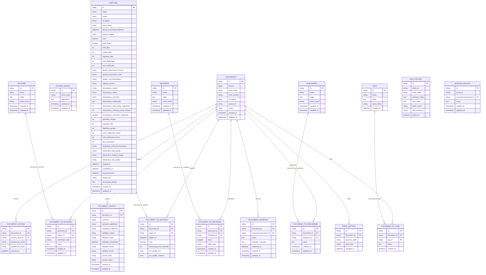

# CWIS Preservation Database Schema

```mermaid
erDiagram
    DOCUMENTS {
        string id PK
        bigint filesize
        string hash_binary
        string hash_content
        string id_legacy
        string source_id
        string name
        timestamp created_at
        timestamp updated_at
    }

    DOCUMENT_ACCESS {
        string id PK
        string document_id FK
        string access_level_id FK
        string granted_by_name
        string granted_by_email
        datetime granted_at
    }

    ACCESS_LEVELS {
        string id PK
        string level_name
        text description
        timestamp created_at
        timestamp updated_at
    }

    DOCUMENT_QUALITY {
        string id PK
        string document_id FK
        string comment
        string comment_additional
        string metadata_sufficiency
        string validation_status
        string validation_type
        datetime validation_timestamp
        string validator_name
        string validator_email
        string access_level
        string current_status
        timestamp created_at
        timestamp updated_at
    }

    STATE_HISTORY {
        string id PK
        string document_id FK
        string previous_state
        string new_state
        datetime changed_at
    }

    DOCUMENT_TO_AUTHORS {
        string id PK
        string document_id FK
        string author_id FK
        string contributor_type
        text notes
        timestamp created_at
        timestamp updated_at
    }

    AUTHORS {
        string id PK
        string name
        text notes
        string name_hash
        timestamp created_at
        timestamp updated_at
    }

    DOCUMENT_TO_BATCHES {
        string id PK
        string document_id FK
        string batch_id FK
        datetime added_at
        decimal cost
        int processing_time_seconds
        bool ocr_quality_low
        bool ocr_quality_medium
    }

    BATCHES {
        string id PK
        string name
        string status
        string id_legacy
        string name_hash
        datetime binary_processing_datetime
        string dedup_method
        decimal cost
        decimal cost_saved
        int total_files
        int unique_files
        int duplicate_files
        int inter_duplicates
        int intra_duplicates
        string quality_assessment_source
        string quality_assessment_note
        string quality_recommendation
        string registry_version
        string discrepancy_source
        string discrepancy_status
        string discrepancy_summary
        text discrepancy_explanation
        int discrepancy_total_binary_registered
        int discrepancy_missing_unique_entries
        decimal discrepancy_correction_timestamp
        int duplicate_content
        int duplicate_files
        int duplicate_groups
        int exact_duplicates_found
        int total_duplicates_found
        int files_processed
        string duplicates_removed_timestamp
        string distribution_high_quality
        string distribution_medium_quality
        string distribution_low_quality
        datetime started_at
        datetime completed_at
        datetime last_processed
        string started_by
        text processing_details
        timestamp created_at
        timestamp updated_at
    }

    DOCUMENT_TO_METADATA {
        string id PK
        string document_id FK
        string metadata_id FK
        longtext value
        string value_type
        timestamp created_at
        timestamp updated_at
    }

    METADATA {
        string id PK
        string name
        text notes
        string name_hash
        timestamp created_at
        timestamp updated_at
    }

    DOCUMENT_TO_PUBLISHERS {
        string id PK
        string document_id FK
        string publisher_id FK
        text notes
        timestamp created_at
        timestamp updated_at
    }

    PUBLISHERS {
        string id PK
        string name
        text notes
        string name_hash
        timestamp created_at
        timestamp updated_at
    }

    DOCUMENT_TO_TAGS {
        string id PK
        string document_id FK
        string tag_id FK
        text notes
        datetime created_at
    }

    TAGS {
        string id PK
        string name
        text notes
        string name_hash
        datetime created_at
    }

    DOCUMENT_VERSIONS {
        string id PK
        string document_id FK
        string canonical_document_id FK
        text notes
        text changes_summary
        datetime analyzed_at
        timestamp created_at
        timestamp updated_at
    }

    EDIT_HISTORY {
        string id PK
        string entity_id
        string entity_table
        text previous_value
        text new_value
        string editor_email
        string edit_summary
        datetime edited_at
    }

    VERSION_GROUPS {
        string id PK
        string group_id
        string canonical_document_id FK
        text notes
        timestamp created_at
        timestamp updated_at
    }

    DOCUMENTS ||--o{ DOCUMENT_ACCESS : "access"
    DOCUMENTS ||--o| DOCUMENT_QUALITY : "quality"
    DOCUMENTS ||--o{ DOCUMENT_TO_AUTHORS : "authors"
    DOCUMENTS ||--o{ DOCUMENT_TO_BATCHES : "batches"
    DOCUMENTS ||--o{ DOCUMENT_TO_METADATA : "metadata"
    DOCUMENTS ||--o{ DOCUMENT_TO_PUBLISHERS : "publishers"
    DOCUMENTS ||--o{ DOCUMENT_TO_TAGS : "tags"
    DOCUMENTS ||--o{ DOCUMENT_VERSIONS : "versions"
    DOCUMENTS ||--o{ STATE_HISTORY : "state"
    AUTHORS ||--o{ DOCUMENT_TO_AUTHORS : "document_to_authors"
    BATCHES ||--o{ DOCUMENT_TO_BATCHES : "document_to_batches"
    METADATA ||--o{ DOCUMENT_TO_METADATA : "document_to_metadata"
    PUBLISHERS ||--o{ DOCUMENT_TO_PUBLISHERS : "document_to_publishers"
    TAGS ||--o{ DOCUMENT_TO_TAGS : "document_to_tags"

%% Unique constraints:
%%   DOCUMENTS.id_legacy (unique)
%%   ACCESS_LEVELS.level_name (unique)
%%   AUTHORS.name (unique)
%%   METADATA.name (unique)
%%   PUBLISHERS.name (unique)
%%   TAGS.name (unique)
%%   DOCUMENT_QUALITY.document_id (unique)
%%   DOCUMENT_TO_AUTHORS.(document_id, author_id) (composite unique)
%%   DOCUMENT_TO_BATCHES.(document_id, batch_id) (composite unique)
%%   DOCUMENT_TO_METADATA.(document_id, metadata_id) (composite unique)
%%   DOCUMENT_TO_PUBLISHERS.(document_id, publisher_id) (composite unique)
%%   DOCUMENT_TO_TAGS.(document_id, tag_id) (composite unique)
```
