# CWIS Preservation Database Schema

```mermaid
erDiagram
    documents {
        varchar id PK, UK
        bigint filesize
        varchar hash_binary
        varchar hash_content
        varchar id_legacy
        varchar name
        timestamp created_at
        timestamp updated_at
    }

    document_access {
        varchar id PK, UK
        varchar document_id FK
        varchar access_level_id FK
        varchar granted_by_name
        varchar granted_by_email
        timestamp granted_at
    }

    access_levels {
        varchar id PK, UK
        varchar level_name UK
        text description
        timestamp created_at
        timestamp updated_at
    }

    document_quality {
        varchar id PK, UK
        varchar document_id FK, UK
        text comment
        text comment_additional
        varchar metadata_sufficiency
        varchar validation_status
        varchar validation_type
        timestamp validation_timestamp
        varchar validator_name
        varchar validator_email
        varchar access_level FK
        varchar current_status FK
        timestamp created_at
        timestamp updated_at
    }

    state_history {
        varchar id PK, UK
        varchar document_id FK
        varchar previous_state
        varchar new_state
        timestamp changed_at
    }

    document_to_authors {
        varchar id PK, UK
        varchar document_id FK
        varchar author_id FK
        varchar contributor_type
        text notes
        timestamp created_at
        timestamp updated_at
    }

    authors {
        varchar id PK, UK
        text name
        varchar name_hash UK
        text notes
        timestamp created_at
        timestamp updated_at
    }

    document_to_batches {
        varchar id PK, UK
        varchar document_id FK
        varchar batch_id FK
        timestamp added_at
        decimal cost
        int processing_time_seconds
        bool ocr_quality_low
        bool ocr_quality_medium
    }

    batches {
        varchar id PK, UK
        varchar id_legacy
        text name
        varchar name_hash UK
        json processing_details
        timestamp created_at
        timestamp updated_at
        timestamp started_at
        timestamp completed_at
        timestamp last_processed
        varchar started_by
    }

    batch_to_batches_metadata {
        varchar id PK, UK
        varchar batch_id FK
        varchar batch_metadata_id FK
        json value
        varchar value_type
        timestamp created_at
        timestamp updated_at
    }

    batch_metadata {
        varchar id PK, UK
        text name
        varchar name_hash UK
        text notes
        timestamp created_at
        timestamp updated_at
    }

    document_to_metadata {
        varchar id PK, UK
        varchar document_id FK
        varchar metadata_id FK
        json value
        varchar value_type
        timestamp created_at
        timestamp updated_at
    }

    metadata {
        varchar id PK, UK
        text name
        varchar name_hash UK
        text notes
        timestamp created_at
        timestamp updated_at
    }

    document_to_publishers {
        varchar id PK, UK
        varchar document_id FK
        varchar publisher_id FK
        text notes
        timestamp created_at
        timestamp updated_at
    }

    publishers {
        varchar id PK, UK
        text name
        varchar name_hash UK
        text notes
        timestamp created_at
        timestamp updated_at
    }

    document_to_tags {
        varchar id PK, UK
        varchar document_id FK
        varchar tag_id FK
        text notes
        timestamp created_at
    }

    tags {
        varchar id PK, UK
        text name
        varchar name_hash UK
        text notes
        timestamp created_at
        timestamp updated_at
    }

    document_versions {
        varchar id PK, UK
        varchar document_id FK
        varchar version_group_id FK
        text notes
        text changes_summary
        timestamp analyzed_at
        timestamp created_at
        timestamp updated_at
    }

    version_groups {
        varchar id PK, UK
        varchar canonical_document_id FK, UK
        text notes
        timestamp created_at
        timestamp updated_at
    }

    edit_history {
        varchar id PK, UK
        varchar entity_id
        varchar entity_table
        text previous_value
        text new_value
        varchar editor_email
        varchar edit_summary
        timestamp edited_at
    }

    documents ||--o{ document_access : "access"
    documents ||--o| document_quality : "quality"
    documents ||--o{ document_to_authors : "authors"
    documents ||--o{ document_to_batches : "batches"
    documents ||--o{ document_to_metadata : "metadata"
    documents ||--o{ document_to_publishers : "publishers"
    documents ||--o{ document_to_tags : "tags"
    documents ||--o{ document_versions : "versions"
    documents ||--o{ state_history : "state"
    authors ||--o{ document_to_authors : "document_to_authors"
    publishers ||--o{ document_to_publishers : "document_to_publishers"
    batches ||--o{ document_to_batches : "document_to_batches"
    batches ||--o{ batch_to_batches_metadata : "batch_metadata"
    metadata ||--o{ document_to_metadata : "document_to_metadata"
    batch_metadata ||--o{ batch_to_batches_metadata : "batch_metadata"
    tags ||--o{ document_to_tags : "document_to_tags"
    version_groups ||--o{ document_versions : "document_versions"
    access_levels ||--o{ document_quality : "access_levels"

%% Composite Indexes:
%%   document_to_authors.(document_id, author_id) (composite unique)
%%   document_to_batches.(document_id, batch_id) (composite unique)
%%   document_to_metadata.(document_id, metadata_id) (composite unique)
%%   document_to_publishers.(document_id, publisher_id) (composite unique)
%%   document_to_tags.(document_id, tag_id) (composite unique)
%%   document_versions.(document_id, version_group_id) (composite unique)
```

---

## Table Reference

### documents

The central entity table. Stores core information about each preserved document.

**What it stores:** The primary record for every document in the system. This is the
anchor entity that all other tables relate to.

**Key columns:**

- `id` - Primary key (UUID).
- `id_legacy` - Human-readable unique identifier. This is the stable identifier surfaced
  to users.
- `name` - Document name. Not a path; the name only.
- `hash_binary` - SHA-256 hash of the raw file bytes. Used to detect binary-level
  duplicates across all sources. Indexed for fast lookups.
- `hash_content` - SHA-256 hash of the extracted text or content. Used to detect
  content-level duplicates independent of file format. Indexed.
- `filesize` - Size of the file in bytes, stored as BigInt.

**Design notes:**

- There are no columns for file path, URL, or MIME type. Those are managed by the
  storage layer outside this database.
- `hash_binary` and `hash_content` are the two pillars of the deduplication strategy.
  A match on either hash signals a potential duplicate.
- `id_legacy` has a unique constraint; it is the business-facing identifier.

### document_quality

Quality assessment and metadata sufficiency validation for each document.

**What it stores:** A single quality record per document covering validation results,
assessor comments, and the current validation status.

**Key columns:**

- `id` - Primary key (UUID).
- `document_id` - Foreign key to `documents`. Enforced unique via
  `uk_document_quality_document_id`.
- `validation_status` - Outcome of the quality check, such as `passed` or `failed`.
- `validation_type` - The type of validation performed.
- `validation_timestamp` - When the validation ran.
- `validator_name` / `validator_email` - Who performed the validation, for
  accountability.
- `metadata_sufficiency` - Assessment of whether the document's metadata is complete
  enough to be useful.
- `comment` / `comment_additional` - Free-text assessment notes.
- `current_status` - References `state_history.id`, linking the quality record to the
  document's current state entry.
- `access_level` - Suggested or assigned access level from the quality review.

**Design notes:**

- One-to-one with `documents` (enforced by unique constraint on `document_id`).
- `current_status` is the FK to `state_history.id`; through this relation the quality
  record is tied to the document's latest state transition.

### state_history

Tracks state transitions for documents over time.

**What it stores:** An append-only log of every state change a document goes through.

**Key columns:**

- `id` - Primary key (UUID).
- `document_id` - Foreign key to `documents`.
- `previous_state` - The state before the transition (free-text string).
- `new_state` - The state after the transition (free-text string).
- `changed_at` - When the transition occurred.

**Design notes:**

- `previous_state` and `new_state` are free-text strings. The schema does not
  prescribe a fixed vocabulary; applications enforce that convention.
- A single document can have many state transitions recorded (one-to-many from
  `documents`).
- Referenced by `document_quality.current_status` to expose the current state within
  the quality record.

### document_to_authors

Many-to-many join table linking documents to their authors.

**What it stores:** Author attributions for documents. Supports distinguishing primary
authors from secondary contributors.

**Key columns:**

- `id` - Primary key (UUID).
- `document_id` / `author_id` - Foreign keys.
- `contributor_type` - Distinguishes primary authors from co-authors, editors,
  translators, and similar roles.
- `notes` - Free-text notes about this attribution, such as `confirmed via email`.

**Design notes:**

- Composite unique constraint on `(document_id, author_id)` prevents duplicate attributions.
- Cascades deletes. Removing an author or document removes the association automatically.

### authors

Named authors referenced by documents.

**What it stores:** Author name directory. Used as the authoritative lookup for author
identities.

**Key columns:**

- `id` - Primary key (UUID).
- `name` - The author's name, stored as Text (free-form).
- `notes` - Internal notes about this author.
- `name_hash` - MD5 of `name` for deduplication and unique lookups. Constrained unique.

**Design notes:**

- `name` has no unique constraint itself; deduplication uses `name_hash`.
- Cascades from `document_to_authors`. Deleting an author removes all attributions.

### document_to_batches

Links documents to the processing batches they were included in.

**What it stores:** Per-document processing record within a batch: cost, duration, and
OCR quality flags.

**Key columns:**

- `id` - Primary key (UUID).
- `document_id` / `batch_id` - Foreign keys.
- `cost` - Decimal cost incurred for processing this document in the batch.
- `processing_time_seconds` - Wall-clock time to process the document.
- `ocr_quality_low` / `ocr_quality_medium` - Boolean flags indicating OCR quality issues
  detected.
- `added_at` - When the document was added to the batch.

**Design notes:**

- Composite unique constraint on `(document_id, batch_id)`. A document can be in the
  same batch only once.
- Allows granular cost and timing tracking per document within a batch.

### batches

Processing batch records. Each batch represents one ingestion or processing run.

**What it stores:** The lean core record for a processing batch. Extended batch
attributes now live in `batch_to_batches_metadata`.

**Key columns:**

- `id` - Primary key (UUID).
- `id_legacy` - Legacy identifier for the batch.
- `name` / `name_hash` - Batch name and its MD5 hash. The hash is unique via
  `uk_batches_name`.
- `processing_details` - JSON for free-form processing details that still belong on the
  core batch row.
- `created_at` / `updated_at` - Audit timestamps for the row itself.
- `started_at` / `completed_at` / `last_processed` - Timing fields for the batch
  lifecycle.
- `started_by` - Who or what initiated the batch.

**Design notes:**

- `name_hash` is unique. Used for idempotent batch creation - the same name implies the
  same batch identity.
- Batch-specific attributes that used to live directly on `batches` now use the
  `batch_metadata` catalog plus `batch_to_batches_metadata` values.
- Cascades to `document_to_batches` and `batch_to_batches_metadata`. Deleting a batch
  removes its join rows.

### batch_to_batches_metadata

Key-value metadata values attached to batches.

**What it stores:** Instance values for metadata fields defined in `batch_metadata`,
applied to a specific batch.

**Key columns:**

- `id` - Primary key (UUID).
- `batch_id` / `batch_metadata_id` - Foreign keys.
- `value` - The batch metadata value, stored as JSON.
- `value_type` - The application-level type hint for the value, such as `string`,
  `number`, or `timestamp`.
- `created_at` / `updated_at` - Audit timestamps for the metadata assignment.

**Design notes:**

- Mirrors the `document_to_metadata` pattern for batches.
- Cascades from both `batches` and `batch_metadata`.

### batch_metadata

Metadata field definitions for batches.

**What it stores:** The catalog of recognized batch metadata field names.

**Key columns:**

- `id` - Primary key (UUID).
- `name` - Field name (Text).
- `name_hash` - MD5 of `name` for unique lookups. Constrained unique via
  `uk_batch_metadata_name`.
- `notes` - Description or usage notes for the field.

**Design notes:**

- `name_hash` uniqueness enforces that field names are deduplicated.
- Seeded with the former wide `batches` columns that were moved into metadata.

### document_to_metadata

Key-value metadata values attached to documents.

**What it stores:** Instance values for metadata fields defined in the `metadata`
table, applied to a document.

**Key columns:**

- `id` - Primary key (UUID).
- `document_id` / `metadata_id` - Foreign keys.
- `value` - The metadata value. Stored as LongText so it can hold long extracted
  values, including full OCR text or large JSON blobs.
- `value_type` - The data type of the value, such as `string`, `date`, or `number`,
  for consumer interpretation.

**Design notes:**

- Composite unique constraint on `(document_id, metadata_id)`. A given metadata field
  can be assigned to a document only once.
- `value` is LongText specifically to support long extracted values.

### metadata

Metadata field definitions. Defines the schema of what metadata fields exist.

**What it stores:** The catalog of recognized metadata field names.

**Key columns:**

- `id` - Primary key (UUID).
- `name` - Field name (Text).
- `name_hash` - MD5 of `name` for unique lookups. Constrained unique via
  `uk_metadata_name`.
- `notes` - Description or usage notes for the field.

**Design notes:**

- `name_hash` uniqueness enforces that field names are deduplicated. The raw `name`
  column has no unique constraint.
- Consumers use `metadata.name` to look up the field definition, then
  `document_to_metadata.value` for the instance value.

### document_to_publishers

Links documents to their publishers.

**What it stores:** Publisher attributions for documents.

**Key columns:**

- `id` - Primary key (UUID).
- `document_id` / `publisher_id` - Foreign keys.
- `notes` - Notes about this attribution.

**Design notes:**

- Composite unique constraint on `(document_id, publisher_id)`.
- Mirrors the pattern of `document_to_authors` and `document_to_tags`.

### publishers

Named publishers referenced by documents.

**What it stores:** Publisher name directory.

**Key columns:**

- `id` - Primary key (UUID).
- `name` - Publisher name (Text, free-form).
- `name_hash` - MD5 of `name`, constrained unique for deduplication.
- `notes` - Internal notes.

**Design notes:**

- Same pattern as `authors` and `tags`. Deduplication uses `name_hash`, not the raw
  `name` column.

### document_to_tags

Tags (categorization labels) applied to documents.

**What it stores:** Tag assignments.

**Key columns:**

- `id` - Primary key (UUID).
- `document_id` / `tag_id` - Foreign keys.
- `notes` - Optional notes about this tag assignment.

**Design notes:**

- Composite unique constraint on `(document_id, tag_id)` prevents the same tag from
  being applied twice to a document.
- Same join-table pattern as the other `document_to_*` tables.

### tags

Tag definitions. Represents the controlled vocabulary of categorization labels.

**What it stores:** Tag name directory.

**Key columns:**

- `id` - Primary key (UUID).
- `name` - Tag name (Text).
- `name_hash` - MD5 of `name`, constrained unique.
- `notes` - Description or scope notes.
- `created_at` - When the tag was created.
- `updated_at` - When the tag row was last updated.

**Design notes:**

- `name_hash` uniqueness ensures tag names are deduplicated.
- Tag names are stored as Text and deduplicated via `name_hash`, matching the same
  general pattern used by other controlled-vocabulary tables.

### document_versions

Tracks document version history. Records non-canonical versions and their relationship
to a version group.

**What it stores:** Each row represents a single version of a document, linked to the
document itself and to its enclosing version group.

**Key columns:**

- `id` - Primary key (UUID).
- `document_id` - The version this row describes.
- `version_group_id` - Foreign key to `version_groups.id`, identifying the related
  version family for this document version.
- `changes_summary` - Description of what changed from the canonical version.
- `analyzed_at` - When version analysis was performed.
- `notes` - Free-text notes about this version.

**Design notes:**

- `version_group_id` FK points to `version_groups`, not directly to `documents`.
- The canonical document is resolved through the related `version_groups` row.
- `analyzed_at` (Timestamp) differs from `created_at`/`updated_at` (Timestamp). It
  records when analysis ran, not when the row was created.

### edit_history

General-purpose audit trail for changes to any entity in the database.

**What it stores:** Before/after snapshots of edited values, tied to an editor and a
summary.

**Key columns:**

- `id` - Primary key (UUID).
- `entity_table` - The table that was edited.
- `entity_id` - The primary key of the row that was edited.
- `previous_value` / `new_value` - The old and new content of the changed field.
- `editor_email` - Who made the edit.
- `edit_summary` - Human-readable description of the change.
- `edited_at` - When the edit occurred.

**Design notes:**

- Generic (`entity_table` + `entity_id`) design allows auditing any table without a
  per-table history table.
- No FK constraints on `entity_table` or `entity_id`. This is intentional - the table
  operates independently of schema changes.
- Indexed on `(entity_table, entity_id)` for efficient retrieval of history for a given row.

### version_groups

Groups related document versions together and identifies the canonical version of each
group.

**What it stores:** One row per group of related document versions, designating the
canonical version.

**Key columns:**

- `id` - Primary key (UUID).
- `group_id` - Groups versions together. All versions with the same `group_id` belong
  to the same logical document family.
- `canonical_document_id` - Points to the primary or authoritative version in the
  group. Constrained unique via
  `uk_version_groups_canonical_document_id`.
- `notes` - Group-level notes.

**Design notes:**

- `canonical_document_id` FK points to `documents`. The canonical is itself a document.
- `canonical_document_id` is unique, so a document can be canonical for at most one
  version group.
- Multiple rows can share the same `group_id` (one per version in the group).
- Indexed on both `group_id` and `canonical_document_id` for flexible lookups.
- A lighter-weight sibling to `document_versions` for grouping without the full
  version-analysis overhead.

### access_levels

Role-based access level definitions. Controls who can see what.

**What it stores:** The catalog of access levels, such as `public`, `restricted`, and
`internal`.

**Key columns:**

- `id` - Primary key (UUID).
- `level_name` - Unique name of the access level.
- `description` - Human-readable description of the level.

**Design notes:**

- `level_name` is unique. Access levels are identified by name, not a numeric rank.
- Referenced by `document_access` to assign a level to a document for a specific person.
- Cascades to `document_access` on delete.
