# CWIS Preservation Database Schema

```mermaid
erDiagram
    documents {
        varchar id PK, UK
        bigint filesize
        varchar hash_binary
        varchar hash_content
        varchar id_legacy
        varchar name
        timestamp created_at
        timestamp updated_at
    }

    document_access {
        varchar id PK, UK
        varchar document_id FK
        varchar access_level_id FK
        varchar granted_by_name
        varchar granted_by_email
        timestamp granted_at
    }

    access_levels {
        varchar id PK, UK
        varchar level_name UK
        text description
        timestamp created_at
        timestamp updated_at
    }

    document_quality {
        varchar id PK, UK
        varchar document_id FK, UK
        text comment
        text comment_additional
        varchar metadata_sufficiency
        varchar validation_status
        varchar validation_type
        bigint validation_timestamp
        varchar validator_name
        varchar validator_email
        varchar access_level FK
        varchar current_status FK
        timestamp created_at
        timestamp updated_at
    }

    state_history {
        varchar id PK, UK
        varchar document_id FK
        varchar previous_state
        varchar new_state
        timestamp changed_at
    }

    document_to_authors {
        varchar id PK, UK
        varchar document_id FK
        varchar author_id FK
        varchar contributor_type
        text notes
        timestamp created_at
        timestamp updated_at
    }

    authors {
        varchar id PK, UK
        text name
        varchar name_hash UK
        text notes
        timestamp created_at
        timestamp updated_at
    }

    document_to_batches {
        varchar id PK, UK
        varchar document_id FK
        varchar batch_id FK
        timestamp added_at
        text batch_origin
        decimal cost
        int processing_time_seconds
        bool ocr_quality_low
        bool ocr_quality_medium
    }

    batches {
        varchar id PK, UK
        varchar id_legacy
        text name
        varchar name_hash UK
        json processing_details
        timestamp created_at
        timestamp updated_at
        timestamp started_at
        timestamp completed_at
        timestamp last_processed
        varchar started_by
    }

    batch_to_batches_metadata {
        varchar id PK, UK
        varchar batch_id FK
        varchar batch_metadata_id FK
        json value
        varchar value_type
        timestamp created_at
        timestamp updated_at
    }

    batch_metadata {
        varchar id PK, UK
        text name
        varchar name_hash UK
        text notes
        timestamp created_at
        timestamp updated_at
    }

    document_to_metadata {
        varchar id PK, UK
        varchar document_id FK
        varchar metadata_id FK
        json value
        varchar value_type
        timestamp created_at
        timestamp updated_at
    }

    metadata {
        varchar id PK, UK
        text name
        varchar name_hash UK
        text notes
        timestamp created_at
        timestamp updated_at
    }

    document_to_publishers {
        varchar id PK, UK
        varchar document_id FK
        varchar publisher_id FK
        text notes
        timestamp created_at
        timestamp updated_at
    }

    publishers {
        varchar id PK, UK
        text name
        varchar name_hash UK
        text notes
        timestamp created_at
        timestamp updated_at
    }

    document_to_tags {
        varchar id PK, UK
        varchar document_id FK
        varchar tag_id FK
        text notes
        timestamp created_at
    }

    tags {
        varchar id PK, UK
        text name
        varchar name_hash UK
        text notes
        timestamp created_at
        timestamp updated_at
    }

    collections {
        varchar id PK, UK
        varchar tag_id FK, UK
        text notes
        timestamp created_at
        timestamp updated_at
    }

    document_versions {
        varchar id PK, UK
        varchar document_id FK
        varchar version_group_id FK
        text notes
        text changes_summary
        bigint analyzed_at
        timestamp created_at
        timestamp updated_at
    }

    version_groups {
        varchar id PK, UK
        varchar canonical_document_id FK, UK
        text notes
        timestamp created_at
        timestamp updated_at
    }

    edit_history {
        varchar id PK, UK
        varchar entity_id
        varchar entity_table
        json previous_value
        json new_value
        varchar editor_email
        varchar edit_summary
        timestamp edited_at
    }

    documents ||--o{ document_access : "access"
    documents ||--o| document_quality : "quality"
    documents ||--o{ document_to_authors : "authors"
    documents ||--o{ document_to_batches : "batches"
    documents ||--o{ document_to_metadata : "metadata"
    documents ||--o{ document_to_publishers : "publishers"
    documents ||--o{ document_to_tags : "tags"
    documents ||--o{ document_versions : "versions"
    documents ||--o{ state_history : "state"
    documents ||--o| version_groups : "canonical_for"
    authors ||--o{ document_to_authors : "document_to_authors"
    publishers ||--o{ document_to_publishers : "document_to_publishers"
    batches ||--o{ document_to_batches : "document_to_batches"
    batches ||--o{ batch_to_batches_metadata : "batch_metadata"
    metadata ||--o{ document_to_metadata : "document_to_metadata"
    batch_metadata ||--o{ batch_to_batches_metadata : "batch_metadata"
    tags ||--o{ document_to_tags : "document_to_tags"
    tags ||--o| collections : "collection"
    version_groups ||--o{ document_versions : "document_versions"
    state_history ||--o{ document_quality : "current_status"
    access_levels ||--o{ document_access : "document_access"
    access_levels ||--o{ document_quality : "access_levels"

%% Composite Indexes:
%%   document_to_authors.(document_id, author_id) (composite unique)
%%   document_to_batches.(document_id, batch_id) (composite unique)
%%   document_to_metadata.(document_id, metadata_id) (composite unique)
%%   document_to_publishers.(document_id, publisher_id) (composite unique)
%%   document_to_tags.(document_id, tag_id) (composite unique)
%%   document_versions.(document_id, version_group_id) (composite unique)
```

---

## How To Read This Schema

- `documents` is the anchor table. Most queries start there and join outward.
- `batches` is the anchor table for processing runs and registry-derived batch context.
- `document_to_*` tables and `batch_to_batches_metadata` are association tables. They connect a
  core entity to a lookup table or to typed metadata values.
- `metadata` and `batch_metadata` define field names. The actual values live in
  `document_to_metadata` and `batch_to_batches_metadata`.
- Several lookup tables use a generated `name_hash` column. This is primarily for deduplication and
  indexing, not for human-facing querying.
- JSON values are stored in MariaDB `JSON` columns. For analysis, expect to use JSON extraction
  functions when reading structured values.

## Query-Oriented Notes

- Use `documents.id` and `batches.id` for joins.
- Use `documents.id_legacy` and `batches.id_legacy` when you need to match back to source-system
  identifiers.
- `document_quality.validation_timestamp` and `document_versions.analyzed_at` are `BIGINT` unix
  timestamps. Most other temporal columns are SQL `TIMESTAMP`.
- `document_to_metadata.value_type` and `batch_to_batches_metadata.value_type` are hints about the
  logical type of the JSON payload in `value`.
- `state_history` is an append-only event table. `document_quality.current_status` points to one row
  in that history.
- `state_history` prevents exact duplicate transitions with a composite unique constraint on
  `(document_id, previous_state, new_state, changed_at)`.

## Index Highlights

- `documents` is indexed on `created_at`, `updated_at`, `name`, `filesize`, `hash_binary`, and
  `hash_content`.
- `state_history` is indexed on `document_id` and `(document_id, changed_at)`.
- `state_history` is also unique on `(document_id, previous_state, new_state, changed_at)`.
- `edit_history` is indexed on `(entity_table, entity_id)` and
  `(entity_table, entity_id, edited_at)`.
- `document_to_metadata` supports both document-first and metadata-first access patterns.
- `document_to_tags` supports both document-first and tag-first access patterns.
- `collections` is indexed and unique on `tag_id`.
- Association tables use composite unique constraints to prevent duplicate links.

## Table Reference

### documents

Primary document records.

| Column | Type | Notes |
| --- | --- | --- |
| `id` | `VARCHAR(36)` | Primary key. UUID string. |
| `filesize` | `BIGINT` | File size in bytes. |
| `hash_binary` | `VARCHAR(255)` | Binary/file-level hash. Indexed. |
| `hash_content` | `VARCHAR(255)` | Content/text-level hash. Indexed. |
| `id_legacy` | `VARCHAR(255)` | Unique source-system document identifier. |
| `name` | `VARCHAR(255)` | Document name. |
| `created_at` | `TIMESTAMP` | Row creation time. |
| `updated_at` | `TIMESTAMP` | Row update time. |

Common joins: `document_quality`, `state_history`, `document_access`, `document_to_metadata`,
`document_to_tags`, `document_to_authors`, `document_to_publishers`, `document_to_batches`,
`document_versions`.

### document_access

Access-level assignments for documents.

| Column | Type | Notes |
| --- | --- | --- |
| `id` | `VARCHAR(36)` | Primary key. |
| `document_id` | `VARCHAR(36)` | FK to `documents.id`. |
| `access_level_id` | `VARCHAR(36)` | FK to `access_levels.id`. |
| `granted_by_name` | `VARCHAR(255)` | Grantor/display name. |
| `granted_by_email` | `VARCHAR(255)` | Grantor email. |
| `granted_at` | `TIMESTAMP` | Assignment timestamp. |

Constraint notes: unique on `(document_id, access_level_id)`.

### access_levels

Lookup table for access vocabulary.

| Column | Type | Notes |
| --- | --- | --- |
| `id` | `VARCHAR(36)` | Primary key. |
| `level_name` | `VARCHAR(255)` | Unique access level name. |
| `description` | `TEXT` | Human-readable description. |
| `created_at` | `TIMESTAMP` | Row creation time. |
| `updated_at` | `TIMESTAMP` | Row update time. |

Typical values include `public`, `restricted`, `internal`, `admin`, and `confidential`.

### document_quality

One quality/validation record per document.

| Column | Type | Notes |
| --- | --- | --- |
| `id` | `VARCHAR(36)` | Primary key. |
| `document_id` | `VARCHAR(36)` | FK to `documents.id`. Unique. |
| `comment` | `TEXT` | Primary quality note. |
| `comment_additional` | `TEXT` | Additional quality note. |
| `metadata_sufficiency` | `VARCHAR(255)` | Sufficiency assessment. |
| `validation_status` | `VARCHAR(255)` | Validation outcome/status. |
| `validation_type` | `VARCHAR(255)` | Type of validation performed. |
| `validation_timestamp` | `BIGINT` | Unix timestamp. |
| `validator_name` | `VARCHAR(255)` | Validator display name. |
| `validator_email` | `VARCHAR(255)` | Validator email. |
| `access_level` | `VARCHAR(36)` | FK to `access_levels.id`. |
| `current_status` | `VARCHAR(36)` | FK to `state_history.id`. |
| `created_at` | `TIMESTAMP` | Row creation time. |
| `updated_at` | `TIMESTAMP` | Row update time. |

Query note: this is a one-to-one extension of `documents`.

### state_history

Document state transitions over time.

| Column | Type | Notes |
| --- | --- | --- |
| `id` | `VARCHAR(36)` | Primary key. |
| `document_id` | `VARCHAR(36)` | FK to `documents.id`. |
| `previous_state` | `VARCHAR(255)` | Prior state label. |
| `new_state` | `VARCHAR(255)` | New state label. |
| `changed_at` | `TIMESTAMP` | Transition time. |

Query note: use this table for status history; `document_quality.current_status` points to one row
here. The table also enforces a composite unique constraint on
`(document_id, previous_state, new_state, changed_at)`.

### authors

Author lookup table.

| Column | Type | Notes |
| --- | --- | --- |
| `id` | `VARCHAR(36)` | Primary key. |
| `name` | `TEXT` | Author name. |
| `name_hash` | `VARCHAR(64)` | Generated stored SHA-256 hash of normalized `name`. Unique. |
| `notes` | `TEXT` | Internal notes. |
| `created_at` | `TIMESTAMP` | Row creation time. |
| `updated_at` | `TIMESTAMP` | Row update time. |

### document_to_authors

Document-to-author association table.

| Column | Type | Notes |
| --- | --- | --- |
| `id` | `VARCHAR(36)` | Primary key. |
| `document_id` | `VARCHAR(36)` | FK to `documents.id`. |
| `author_id` | `VARCHAR(36)` | FK to `authors.id`. |
| `contributor_type` | `VARCHAR(255)` | Role such as author, editor, translator. |
| `notes` | `TEXT` | Attribution notes. |
| `created_at` | `TIMESTAMP` | Row creation time. |
| `updated_at` | `TIMESTAMP` | Row update time. |

Constraint notes: unique on `(document_id, author_id)`.

### publishers

Publisher lookup table.

| Column | Type | Notes |
| --- | --- | --- |
| `id` | `VARCHAR(36)` | Primary key. |
| `name` | `TEXT` | Publisher name. |
| `name_hash` | `VARCHAR(64)` | Generated stored SHA-256 hash of normalized `name`. Unique. |
| `notes` | `TEXT` | Internal notes. |
| `created_at` | `TIMESTAMP` | Row creation time. |
| `updated_at` | `TIMESTAMP` | Row update time. |

### document_to_publishers

Document-to-publisher association table.

| Column | Type | Notes |
| --- | --- | --- |
| `id` | `VARCHAR(36)` | Primary key. |
| `document_id` | `VARCHAR(36)` | FK to `documents.id`. |
| `publisher_id` | `VARCHAR(36)` | FK to `publishers.id`. |
| `notes` | `TEXT` | Attribution notes. |
| `created_at` | `TIMESTAMP` | Row creation time. |
| `updated_at` | `TIMESTAMP` | Row update time. |

Constraint notes: unique on `(document_id, publisher_id)`.

### tags

Tag lookup table.

| Column | Type | Notes |
| --- | --- | --- |
| `id` | `VARCHAR(36)` | Primary key. |
| `name` | `TEXT` | Tag name. |
| `name_hash` | `VARCHAR(64)` | Generated stored SHA-256 hash of normalized `name`. Unique. |
| `notes` | `TEXT` | Scope or descriptive notes. |
| `created_at` | `TIMESTAMP` | Row creation time. |
| `updated_at` | `TIMESTAMP` | Row update time. |

Query note: indexed on `name(191)` for name lookups.

### collections

Collection records keyed to a single tag.

| Column | Type | Notes |
| --- | --- | --- |
| `id` | `VARCHAR(36)` | Primary key. UUID string. |
| `tag_id` | `VARCHAR(36)` | FK to `tags.id`. Unique. |
| `notes` | `TEXT` | Optional collection note. |
| `created_at` | `TIMESTAMP` | Row creation time. |
| `updated_at` | `TIMESTAMP` | Row update time. |

Constraint notes: unique on `tag_id`; deleting the referenced tag cascades to this row.

### document_to_tags

Document-to-tag association table.

| Column | Type | Notes |
| --- | --- | --- |
| `id` | `VARCHAR(36)` | Primary key. |
| `document_id` | `VARCHAR(36)` | FK to `documents.id`. |
| `tag_id` | `VARCHAR(36)` | FK to `tags.id`. |
| `notes` | `TEXT` | Assignment note. |
| `created_at` | `TIMESTAMP` | Row creation time. |

Constraint notes: unique on `(document_id, tag_id)`.

### metadata

Lookup table for document metadata field names.

| Column | Type | Notes |
| --- | --- | --- |
| `id` | `VARCHAR(36)` | Primary key. |
| `name` | `TEXT` | Metadata field name. |
| `name_hash` | `VARCHAR(64)` | Generated stored SHA-256 hash of normalized `name`. Unique. |
| `notes` | `TEXT` | Field notes/description. |
| `created_at` | `TIMESTAMP` | Row creation time. |
| `updated_at` | `TIMESTAMP` | Row update time. |

Query note: indexed on `name(191)` for direct metadata-name lookup.

### document_to_metadata

Document metadata values.

| Column | Type | Notes |
| --- | --- | --- |
| `id` | `VARCHAR(36)` | Primary key. |
| `document_id` | `VARCHAR(36)` | FK to `documents.id`. |
| `metadata_id` | `VARCHAR(36)` | FK to `metadata.id`. |
| `value` | `JSON` | Metadata payload. |
| `value_type` | `VARCHAR(50)` | Logical type hint for `value`. |
| `created_at` | `TIMESTAMP` | Row creation time. |
| `updated_at` | `TIMESTAMP` | Row update time. |

Constraint notes: unique on `(document_id, metadata_id)`.

Query note: this table is the main source for file path, URL, MIME type, rights, descriptive
metadata, and many enrichment outputs that are not first-class columns on `documents`.

### batch_metadata

Lookup table for batch metadata field names.

| Column | Type | Notes |
| --- | --- | --- |
| `id` | `VARCHAR(36)` | Primary key. |
| `name` | `TEXT` | Batch metadata field name. |
| `name_hash` | `VARCHAR(64)` | Generated stored SHA-256 hash of normalized `name`. Unique. |
| `notes` | `TEXT` | Field notes/description. |
| `created_at` | `TIMESTAMP` | Row creation time. |
| `updated_at` | `TIMESTAMP` | Row update time. |

### batches

Core batch/process-run records.

| Column | Type | Notes |
| --- | --- | --- |
| `id` | `VARCHAR(36)` | Primary key. |
| `id_legacy` | `VARCHAR(255)` | Source-system batch identifier. Indexed. |
| `name` | `TEXT` | Optional batch label. |
| `name_hash` | `VARCHAR(64)` | Generated stored SHA-256 hash of normalized `name`. Unique when present. |
| `processing_details` | `JSON` | Core processing details stored directly on the batch row. |
| `created_at` | `TIMESTAMP` | Row creation time. |
| `updated_at` | `TIMESTAMP` | Row update time. |
| `started_at` | `TIMESTAMP` | Batch start time. |
| `completed_at` | `TIMESTAMP` | Batch completion time. |
| `last_processed` | `TIMESTAMP` | Last processing timestamp. |
| `started_by` | `VARCHAR(255)` | Initiator name/process label. |

Query note: batch-specific metrics and registry-derived attributes often live in
`batch_to_batches_metadata`, not as top-level columns here.

### batch_to_batches_metadata

Batch metadata values.

| Column | Type | Notes |
| --- | --- | --- |
| `id` | `VARCHAR(36)` | Primary key. |
| `batch_id` | `VARCHAR(36)` | FK to `batches.id`. |
| `batch_metadata_id` | `VARCHAR(36)` | FK to `batch_metadata.id`. |
| `value` | `JSON` | Metadata payload. |
| `value_type` | `VARCHAR(50)` | Logical type hint for `value`. |
| `created_at` | `TIMESTAMP` | Row creation time. |
| `updated_at` | `TIMESTAMP` | Row update time. |

Constraint notes: unique on `(batch_id, batch_metadata_id)`.

### document_to_batches

Document-to-batch association table with per-document batch metrics.

| Column | Type | Notes |
| --- | --- | --- |
| `id` | `VARCHAR(36)` | Primary key. |
| `document_id` | `VARCHAR(36)` | FK to `documents.id`. |
| `batch_id` | `VARCHAR(36)` | FK to `batches.id`. |
| `added_at` | `TIMESTAMP` | Association creation time. |
| `batch_origin` | `TEXT` | Source-side batch/origin value for this document. |
| `cost` | `DECIMAL(12,2)` | Per-document cost within the batch. |
| `processing_time_seconds` | `INT` | Per-document processing time. |
| `ocr_quality_low` | `BOOLEAN` | Low-quality OCR flag. |
| `ocr_quality_medium` | `BOOLEAN` | Medium-quality OCR flag. |

Constraint notes: unique on `(document_id, batch_id)`.

### version_groups

Version families, one row per canonical group.

| Column | Type | Notes |
| --- | --- | --- |
| `id` | `VARCHAR(36)` | Primary key. |
| `canonical_document_id` | `VARCHAR(36)` | FK to `documents.id`. Unique. |
| `notes` | `TEXT` | Group-level note. |
| `created_at` | `TIMESTAMP` | Row creation time. |
| `updated_at` | `TIMESTAMP` | Row update time. |

Query note: this table defines the family; the member documents live in `document_versions`.

### document_versions

Document membership in a version family.

| Column | Type | Notes |
| --- | --- | --- |
| `id` | `VARCHAR(36)` | Primary key. |
| `document_id` | `VARCHAR(36)` | FK to `documents.id`. |
| `version_group_id` | `VARCHAR(36)` | FK to `version_groups.id`. |
| `notes` | `TEXT` | Version note. |
| `changes_summary` | `TEXT` | Summary of changes relative to canonical. |
| `analyzed_at` | `BIGINT` | Unix timestamp. |
| `created_at` | `TIMESTAMP` | Row creation time. |
| `updated_at` | `TIMESTAMP` | Row update time. |

Constraint notes: unique on `(document_id, version_group_id)`.

### edit_history

Generic audit log for edited entities.

| Column | Type | Notes |
| --- | --- | --- |
| `id` | `VARCHAR(36)` | Primary key. |
| `entity_id` | `VARCHAR(36)` | Identifier of the edited row. No FK. |
| `entity_table` | `VARCHAR(255)` | Name of the edited table. |
| `previous_value` | `JSON` | Prior value snapshot. |
| `new_value` | `JSON` | New value snapshot. |
| `editor_email` | `VARCHAR(255)` | Editor identifier. |
| `edit_summary` | `VARCHAR(255)` | Summary of the edit. |
| `edited_at` | `TIMESTAMP` | Edit timestamp. |

Query note: because this table is generic, analysts typically filter by `entity_table` first.
